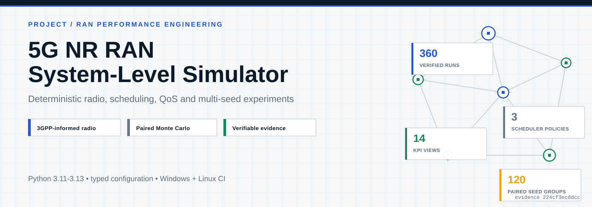
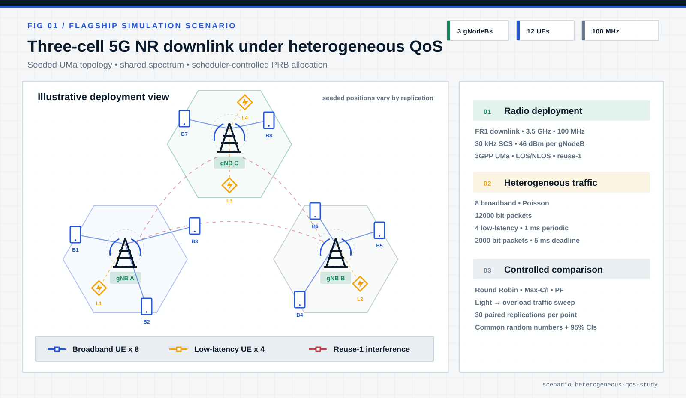
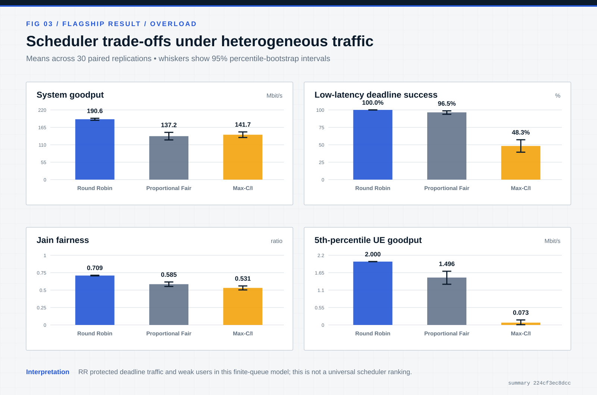
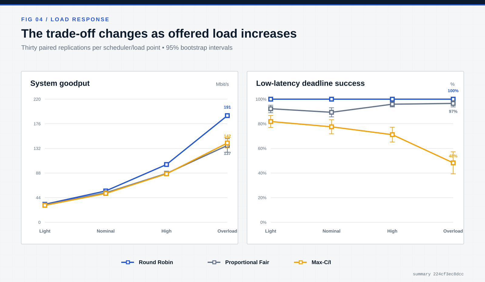
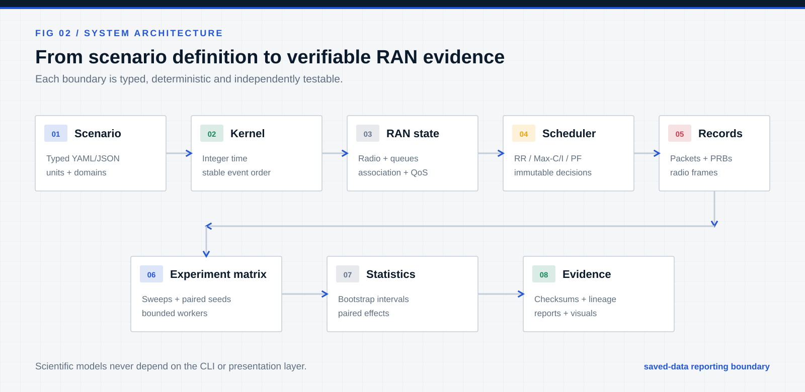
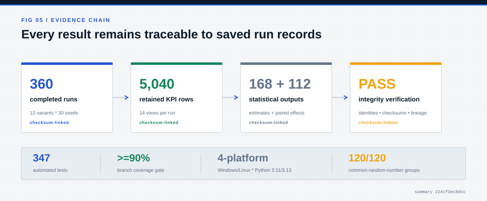

<p align="center">
  
</p>

<p align="center">
  <a href="https://github.com/abdelrahman-fawaz18/5g-nr-ran-simulator/actions/workflows/quality.yml"></a>
  
  
  
</p>

<p align="center">
  <strong>A reproducible 5G NR downlink experimentation platform for scheduler and QoS performance engineering.</strong>
</p>

<p align="center">
  <a href="#run-it-in-five-minutes">Quick start</a> ·
  <a href="docs/experiments/scheduler-performance-study-report.md">Flagship report</a> ·
  <a href="docs/architecture/overview.md">Architecture</a> ·
  <a href="docs/verification/verification-and-validation-report.md">Validation</a> ·
  <a href="docs/models/model-fidelity-contract.md">Model fidelity</a>
</p>

## What this system does

The simulator connects 3GPP-informed large-scale radio models to packet traffic, NR resource
accounting, pluggable schedulers and statistically controlled multi-seed experiments. It is designed
for questions such as:

> How do Round Robin, Max-C/I and Proportional Fair trade aggregate goodput, deadline reliability
> and weak-user service as offered load increases?

| Radio system | MAC and QoS | Experiment engineering |
| --- | --- | --- |
| RMa, UMa and UMi path loss | RR, Max-C/I and EWMA PF | Paired common-random-number runs |
| LOS/NLOS, shadowing and interference | Packet-preserving FIFO queues | Deterministic bootstrap intervals |
| FR1 resources, CQI/MCS and exact TBS | Deadlines, drops and partial service | Checksums, lineage and replay |
| Optional mobility, handover and FR2 | Throughput, delay, fairness and edge KPIs | Windows/Linux continuous verification |

The engineering focus is **controlled RAN performance analysis**: explicit units, deterministic
state transitions, interchangeable scheduling policies, auditable assumptions and evidence that
can be traced back to individual saved runs.

<p align="center">
  
</p>

The flagship scene is a reuse-1, 3.5 GHz FR1 downlink with three 46 dBm gNodeBs. All 12 terminals
are NR UEs; their service requirements differ: broadband traffic drives offered load while the
low-latency class carries a 5 ms packet deadline. UE locations are regenerated from controlled
seeds, so the diagram communicates the system design rather than claiming one fixed realization.

## Flagship scheduler study

The preregistered study executed **360/360 runs** across three schedulers, four broadband load
levels and 30 paired replications per design point. Four deadline-bearing low-latency UEs shared a
three-cell, 3.5 GHz, 100 MHz UMa deployment with eight broadband UEs.

<p align="center">
  
</p>

At the overload operating point:

| Scheduler | System goodput | Deadline success | Jain fairness | 5th-percentile UE goodput |
| --- | ---: | ---: | ---: | ---: |
| **Round Robin** | **190.594 Mbit/s** | **100.0%** | **0.709** | **2.000 Mbit/s** |
| Proportional Fair | 137.187 Mbit/s | 96.5% | 0.585 | 1.496 Mbit/s |
| Max-C/I | 141.714 Mbit/s | 48.3% | 0.531 | 0.073 Mbit/s |

RR improved low-latency deadline success over Max-C/I by **+0.517** (95% CI
**[+0.424, +0.605]**) and fifth-percentile UE goodput by **+1.927 Mbit/s** (95% CI
**[+1.843, +1.994]**). The preregistered PF spectral-efficiency hypothesis was not supported;
PF was lower than Max-C/I by 0.0396 bit/s/Hz at overload.

These results are model-specific. RR's high goodput follows from the declared finite queues,
full-slot Max-C/I allocation and absence of within-slot redistribution—not a general claim that RR
is universally superior. See the [study protocol](docs/experiments/scheduler-performance-study-protocol.md)
and [full result interpretation](docs/experiments/scheduler-performance-study-report.md).

<p align="center">
  
</p>

## Architecture

<p align="center">
  
</p>

The architecture enforces three important boundaries:

1. **Schedulers decide; they do not mutate the simulator.** Each policy consumes an immutable
   observation and returns a validated PRB allocation.
2. **Capacity and delivered traffic are different.** The radio layer calculates allocation-conditional
   capacity; queues determine which packet bits can actually be served.
3. **Reporting consumes saved data only.** Statistical analysis and visualization cannot call the
   live simulator or silently change a result.

Read the [architecture overview](docs/architecture/overview.md) or inspect the typed package under
[`src/nr_ran_sim`](src/nr_ran_sim).

## Engineering evidence

<p align="center">
  
</p>

The verification suite combines:

- analytical and pinned-table reference vectors;
- a separate 50-digit Decimal link-budget oracle;
- deterministic property and metamorphic tests;
- packet, bit and PRB conservation invariants;
- exact replay and approved semantic regressions;
- runtime and Python-managed-memory budgets;
- strict typing, linting, security and dependency audits; and
- a four-job Windows/Linux × Python 3.11/3.13 CI matrix.

The compact [evidence snapshot](evidence/scheduler-study-v1/evidence-manifest.json) contains 5,040
retained KPI rows, 168 estimates, 112 paired effects and checksum-linked source metadata. The
[validation report](docs/verification/verification-and-validation-report.md) separates implementation
verification from external calibration.

## Run it in five minutes

Requirements: CPython 3.11–3.13.

```console
python -m pip install uv==0.12.3
uv sync --frozen --all-extras
uv run nr-ran-sim validate examples/scenarios/scheduler-qos-smoke.yaml --quiet
uv run nr-ran-sim simulate examples/scenarios/scheduler-qos-smoke.yaml \
  --master-seed 0x11111111111111111111111111111111 \
  --replication-id 0 \
  --code-revision 1111111111111111111111111111111111111111 \
  --working-tree-state clean \
  --output artifacts/quick-simulation.json \
  --quiet
```

Run the lightweight paired scheduler experiment:

```console
uv run nr-ran-sim experiment-run examples/experiments/scheduler-comparison-smoke.yaml \
  --output artifacts/paired-smoke \
  --code-revision 1111111111111111111111111111111111111111 \
  --working-tree-state clean
uv run nr-ran-sim experiment-summarize artifacts/paired-smoke
uv run nr-ran-sim experiment-plot artifacts/paired-smoke
uv run nr-ran-sim experiment-verify artifacts/paired-smoke
```

PowerShell syntax, real Git revision recording, the full flagship workflow and expected outputs are
covered in [Getting Started](docs/GETTING_STARTED.md).

## Repository guide

| Area | Start here |
| --- | --- |
| Architecture and data flow | [Architecture overview](docs/architecture/overview.md) |
| Model scope and non-goals | [Model-fidelity contract](docs/models/model-fidelity-contract.md) |
| Radio propagation and link budget | [Radio model](docs/radio/radio-propagation-and-link-budget.md) |
| NR resource and capacity abstraction | [NR capacity model](docs/radio/nr-resource-grid-and-link-adaptation.md) |
| Scheduling, service and KPIs | [MAC and KPI pipeline](docs/mac/scheduling-qos-and-kpis.md) |
| Dynamic radio and bounded FR2 | [Dynamic radio model](docs/radio/mobility-handover-and-fr2.md) |
| Multi-run experiment framework | [Experiment framework](docs/experiments/experiment-orchestration.md) |
| Standards clauses and versions | [Traceability matrix](docs/standards/traceability-matrix.md) |
| Requirements-to-test coverage | [Evidence index](docs/verification/consolidated-requirements-index.yaml) |
| Failure diagnosis | [Troubleshooting](docs/TROUBLESHOOTING.md) |

## Fidelity boundary

This is a **5G NR system-level engineering simulator**, not a bit-accurate PHY, protocol conformance
implementation, commercial RF-planning tool or network digital twin. Its handover and availability
logic are controlled abstractions rather than complete RRC/RLF procedures; its link adaptation is
analytical rather than receiver-calibrated; and its FR2 beam/blockage model is intended for bounded
sensitivity studies.

Claims are limited to the documented model domain. Bootstrap intervals quantify replication
uncertainty inside that domain; they do not quantify real-network model error. The precise supported
and excluded behavior is recorded in the [model-fidelity contract](docs/models/model-fidelity-contract.md).

## License

Copyright © 2026 Abdelrahman Elsayed. Released under the [MIT License](LICENSE). Third-party
dependencies and standards references retain their respective terms; see
[Third-Party Notices](THIRD_PARTY_NOTICES.md).
