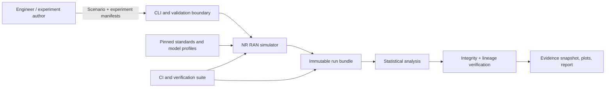
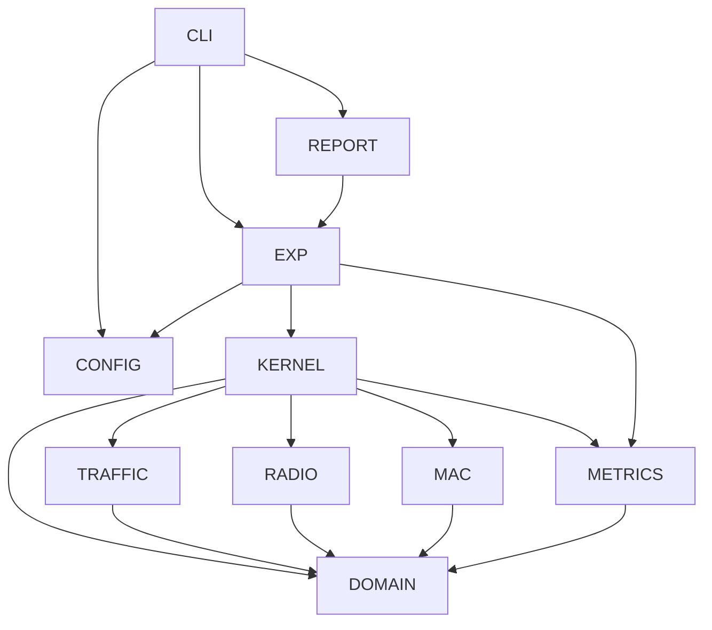
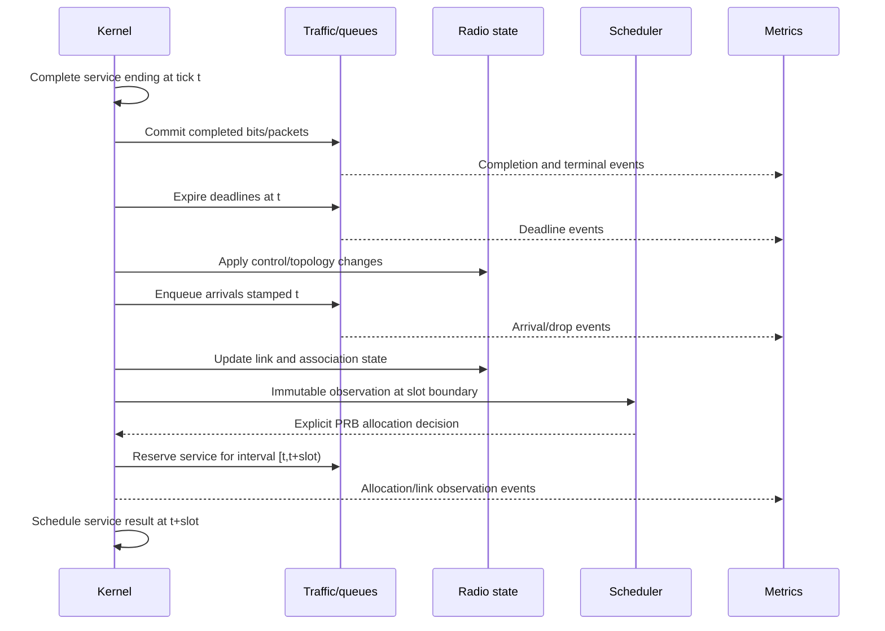

# Architecture Overview

| Field | Value |
| --- | --- |
| Architecture baseline | 1.4 |
| Status | Release candidate with verified flagship evidence and presentation boundary |
| Profiles | Static Tier A plus opt-in dynamic FR1 and bounded FR2-1 |
| Decision records | `adr/` |

## 1. Architectural drivers

The architecture prioritizes scientific auditability over raw feature count:

- determinism for a fixed manifest and seed;
- visible physical units and model domains;
- independent verification of radio equations and tables;
- separation of mechanism from scheduler policy;
- preservation of packet, bit, and resource invariants;
- reproducible multi-run experiments;
- replacement of one model without rewriting the kernel or reporting stack.

## 2. System context



The CLI does not contain model logic. Standards documents are design inputs; implementation uses reviewed project-owned constants/tables with provenance rather than parsing PDFs at runtime.

## 3. Package topology

```text
src/nr_ran_sim/
├── cli/             # Command parsing and user-facing error rendering
├── config/          # Schemas, parsing, units, canonical manifests
├── domain/          # Immutable IDs, entities, packets, events, result types
├── kernel/          # Time, event queue, phase ordering, run state machine
├── traffic/         # Source models and FIFO bearer queues
├── radio/
│   ├── geometry/    # Coordinates and distances
│   ├── propagation/ # Path loss, LOS state, shadowing
│   ├── link/        # Link budget, noise, interference, SINR
│   └── nr/          # Numerology, PRB tables, MCS/CQI, TBS abstraction
├── mac/             # Scheduler protocol and policies
├── metrics/         # Typed event ledger and KPI reducers
├── experiments/     # Sweep expansion, seed plan, execution, run bundles
└── reporting/       # Aggregation, confidence intervals, tables and plots
```

Tests mirror the package plus `tests/reference/`, `tests/integration/`, `tests/reproducibility/`, and `tests/performance/`.

## 4. Dependency rules



Rules:

1. `domain` imports no project package.
2. Scientific model packages do not import CLI, experiments, or reporting.
3. Scheduler policies consume immutable observations and return decisions; they do not call the kernel.
4. Metrics consume typed events and snapshots; models do not call plotting/statistics code.
5. Configuration constructs normalized domain/model specifications but does not run simulation.
6. Reporting reads saved result schemas; it does not require a live kernel.
7. Archived development material is outside the dependency graph.

## 5. Configuration and execution flow

```mermaid
flowchart LR
    A["YAML/JSON input"] --> B["Structural schema validation"]
    B --> C["Unit parsing and canonical conversion"]
    C --> D["Cross-field / standards-domain validation"]
    D --> E["Normalized immutable manifest"]
    E --> F["Run-plan expansion"]
    F --> G["Semantic RNG stream registry"]
    G --> H["Kernel execution"]
    H --> I["Typed events + metrics"]
    I --> J["Atomic run bundle"]
```



No model receives the original mutable YAML dictionary. Validation is fail-closed. The normalized manifest contains explicit defaults and is content-hashed.

## 6. Runtime sequence



Non-slot arrivals are processed at their exact tick but become scheduler-visible at the next slot boundary. An arrival exactly on the boundary is included in that boundary’s observation.

For the dynamic-radio layer profiles, topology/control moves UEs at the configured channel cadence, link phase
updates handover and availability, and scheduling consumes previous-slot cell activity. The result
stores both full-allocation slot frames and actual-allocation SINR diagnostics. The static profile
continues through its original path, so dynamic state cannot silently change approved Tier A runs.

## 7. Core contracts

### Configuration boundary

Input: versioned human document. Output: immutable `NormalizedScenario`, `NormalizedExperiment`, model-profile IDs, warnings (normally none), and content digests.

### Propagation model

Input: immutable scenario/state parameters and a `LinkGeometry`. Output: `PropagationResult` containing path-loss components, domain metadata, and model version. Out-of-domain input raises a domain error.

### Link model

Input: propagation result, transmitter/receiver specs, PRB region, and interference profile. Output: reconstructable `LinkBudgetResult` and link-adaptation decision.

### Scheduler

Input: `SchedulerObservation(tick, cell, eligible_ues, queues, achievable_rates, available_prbs, history)`. Output: `AllocationDecision` containing integer PRBs per UE plus policy diagnostics.

### Metrics

Input: append-only typed event stream and immutable observations. Output: definition-versioned metric tables. Metric reducers do not modify simulation state.

### Run bundle

Atomically committed execution core containing manifests, provenance, full runs, tidy replication
metrics, failure/completeness records, and checksums. Core files are immutable once marked
complete. Saved-data analysis and plot namespaces are append-only derived artifacts with their own
source checksums and collision rejection.

### Experiment and reporting

Input: a strict experiment manifest referencing one base scenario. The experiment layer expands
the scheduler set and optional Cartesian factors, assigns explicit paired replications, constructs
independent run-local state, and atomically stores the complete execution core. The analysis layer
reloads the saved tidy rows, validates their run lineage, and computes deterministic replication
bootstrap intervals and paired scheduler differences. Reporting reloads the saved summary and
writes SVG plus a point-to-row provenance manifest; it has no live-kernel interface.

The publication layer adds a fail-closed verifier across the completion marker, bundle, source-run
files, replication rows, summary, and plot manifest. Only after that check passes can reporting
publish a compact evidence snapshot. Static portfolio visuals consume the verified summary and
contain no simulation, KPI, bootstrap, or result-editing logic.

## 8. State ownership

| State | Owner | Mutation boundary |
| --- | --- | --- |
| Simulation clock/event queue | Kernel | Kernel only |
| Packet lifecycle and queues | Traffic | Commands from kernel service/arrival phases |
| Positions and association | Radio/RAN state | Control/link phases |
| Scheduler history | Scheduler instance per cell | Scheduler decision call only |
| RNG streams | Experiment-created registry | Model receives owned generator; no globals |
| Metrics | Metrics reducers | Typed events only |
| Configuration | None after normalization | Immutable |

## 9. Error model

Error categories are stable domain types:

- `ConfigurationError`: structural/unit/cross-field input failure;
- `ModelDomainError`: scientifically unsupported model input;
- `InvariantViolation`: impossible internal state such as negative queue bits;
- `RunExecutionError`: isolated replication failure;
- `ArtifactError`: incomplete/corrupt/colliding output bundle;
- `DependencyError`: environment or optional-tool failure.

Errors contain requirement/model IDs and structured context. CLI rendering is presentation only.

## 10. Observability

Three separate outputs prevent logs from becoming evidence by accident:

- structured operational logs for humans;
- semantic event traces for deterministic/debug builds;
- versioned metrics/results for analysis.

Trace verbosity is configurable, but run manifest, terminal counts, warnings, and result checksums are mandatory.

## 11. Public API boundary

The supported user surface is the CLI plus versioned manifest and result schemas. Internal Python modules are implementation details and are not part of the compatibility contract.

## 12. Architecture verification

- import/layer rules checked statically;
- no global RNG or mutable configuration;
- scheduler mutation tests;
- event ordering and replay digests;
- run-bundle atomicity/collision tests;
- result generation from saved data only;
- dependency graph and model-profile inventory reviewed at each quality gate.
