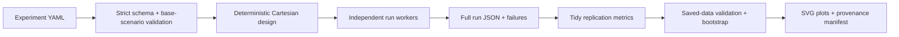
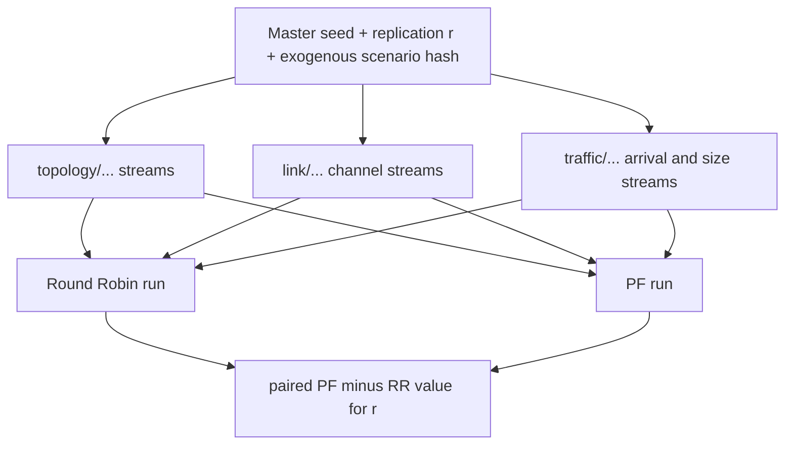

# Experiment Orchestration and Statistical Analysis

## Purpose

The framework changes the unit of work from “one simulator run” to “one auditable engineering study.” A
study declares its design before execution, runs every scheduler/factor/replication cell, preserves
each outcome, estimates uncertainty across replications, and builds plots only from saved data.



The reporting layer can read `bundle.json`, replication rows, summary rows, per-slot dynamic-radio
frames, and the plot manifest. It does not import or bypass the simulator.

## Experiment manifest

`schemas/experiment.schema.json` is generated from the frozen Pydantic models. Important fields:

| Field | Meaning |
| --- | --- |
| `base_scenario` | YAML/JSON scenario used as the immutable starting point |
| `scheduler_set` | Named scheduler levels; parameters are fully typed |
| `sweep_factors` | Named levels applied with an RFC 6901 JSON Pointer |
| `seed_plan` | 128-bit master seed, sorted unique replications, and CRN pairing policy |
| `analysis.metrics` | Exact KPI name, aggregation level, and aggregation ID to retain |
| `analysis` | 95% percentile-bootstrap v1 method and predeclared resample count |
| `execution` | Bounded worker count and explicit failed-run policy |
| `output` | Versions for bundle, replication, summary, and plot contracts |

Timing is inherited from each normalized scenario and copied into every variant inventory as
warm-up, measurement, and drain nanoseconds. Factor values are revalidated through the scenario
schema and unit/domain normalization. Two authored levels that normalize to the same scenario are
rejected rather than executed twice.

## Identity, pairing, and parallel safety

For one non-scheduler factor cell and replication `r`, all scheduler variants reuse the same
semantic topology, propagation, shadow, and traffic paths:



Each worker constructs complete local simulator, scheduler, and semantic-RNG registries. No global
generator or mutable scenario is shared. Run IDs include factor-level IDs explicitly. The bundle
groups scheduler runs by remaining factors/replication and fails if their exogenous hashes differ.
Tests require exact serial/parallel run-ID, semantic-result, metric-dataset, and summary equivalence.

## Bundle layout

```text
experiment-output/
├── COMPLETE
├── bundle.json
├── experiment-manifest.json
├── runs/
│   └── <run-digest>.json
├── metrics/
│   ├── replications.json
│   └── summary.json
└── plots/
    ├── plot-manifest.json
    └── <metric>--<population>.svg
```

`bundle.json` records code revision, dirty state, timestamps, environment/dependencies, execution
method, seed plan, variants/timing, successful runs, structured failures, pairing checks,
completeness, and checksums. `replications.json` is tidy: one row per selected KPI per successful
run. Each row contains its digest, factors, replication, run/result identities, exact KPI
definition/population/null semantics, and source-run path/checksum.

Execution is staged in a temporary sibling and atomically promoted. An existing output directory
is a hard collision. The complete execution core is immutable; summary and plot outputs are
append-only and also reject collisions.

## Uncertainty and comparisons

The analysis unit is the replication value, never the individual packet. For each variant/KPI,
the analyzer retains all rows and reports `n_total`, `n_valid`, null reasons, mean, sample standard
deviation, and a 95% percentile-bootstrap interval.

Bootstrap RNG streams are PCG64DXSM streams derived from the saved metric-dataset hash, experiment
master seed, and semantic analysis path. Therefore analysis is exactly replayable and its engine,
NumPy version, seed words, and fingerprint are saved.

For scheduler comparisons, rows are matched on:

`non-scheduler factors + KPI population + replication ID`.

The saved difference is `candidate - reference`; its interval is calculated from paired
differences. Missing/null pairs remain visible through expected/valid pair counts. Smoke intervals
with only three replications verify the pipeline but must not support performance claims. The
showcase profile declares 30 replications and 10,000 resamples; the flagship study requires a precision
review before interpreting it.

## Validation and anomaly policy

Default analysis refuses a partial experiment. `--allow-partial` is an explicit diagnostic path,
not a way to hide failures. Before aggregation, analysis rejects:

- bundle/dataset checksum or semantic-digest mismatch;
- duplicate row IDs or duplicate run/KPI/replication observations;
- nonnumeric or nonfinite values;
- inconsistent KPI definition versions or units;
- ambiguous null values;
- missing or modified source-run artifacts.

Every plot includes mean and 95% interval markers, explicit units, sample trace IDs, a zero-inclusive
axis, and the experiment hash. `plot-manifest.json` binds the SVG checksum to the saved summary and
lists the replication row IDs behind every point.

## Commands

Validate the design and generated schema:

```console
uv run nr-ran-sim experiment-validate examples/experiments/scheduler-comparison-smoke.yaml
uv run nr-ran-sim experiment-schema
```

Run, analyze, and plot using the actual checked-out revision/state:

```console
uv run nr-ran-sim experiment-run examples/experiments/scheduler-comparison-smoke.yaml \
  --output artifacts/scheduler-comparison-smoke \
  --code-revision <git-revision> \
  --working-tree-state clean
uv run nr-ran-sim experiment-summarize artifacts/scheduler-comparison-smoke
uv run nr-ran-sim experiment-plot artifacts/scheduler-comparison-smoke
```

The smoke profile is for CI/reproducibility and finishes quickly. The showcase manifest expands 3
schedulers × 4 offered-load levels × 30 paired replications = 360 runs and is intentionally not a
routine CI job.

## Interpretation limits

- Bootstrap intervals quantify finite-replication uncertainty inside the declared simulator model;
  they do not validate model realism.
- CRN pairing improves scheduler contrast precision but does not make the policies independent.
- The showcase manifest is a reusable predeclared profile, separate from the completed flagship result.
- Thread workers establish safe concurrent ownership, not a claim of optimal CPU scaling.
- SVG plots are deterministic evidence views that consume the same saved contracts as tabular
  reporting.
