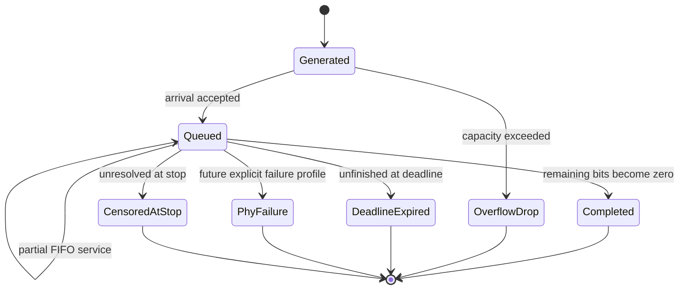

# Deterministic Kernel, Traffic, and Queue Mechanics

## Purpose and boundary

The deterministic mechanics layer supplies the reproducible execution mechanics used by the radio and scheduler models. It does **not** calculate propagation, SINR, transport-block capacity, allocations, or performance KPIs. Its evidence level is implementation plus mechanics verification (E1), not radio-model validation.

The core packages are:

| Package | Responsibility |
| --- | --- |
| `domain` | Type-distinct IDs and immutable cell, UE, bearer, packet, event, and run records |
| `kernel` | Integer time, event heap, phase ordering, handler isolation, semantic trace |
| `traffic` | Source generation, packet commands, FIFO queues, lifecycle and conservation |
| `experiments` | Semantic seed streams, run identity, environment and seed metadata |

## Event execution

Time is signed-64-bit-domain integer nanoseconds. The heap key is exactly:

```text
(tick, phase_priority, entity_key, local_sequence)
```

The frozen phase order is:

1. prior-slot service completion;
2. deadline expiration;
3. topology/control update;
4. packet arrival;
5. link/association update;
6. scheduling;
7. service reservation;
8. observation/censoring.

Therefore a completion at its deadline succeeds, and a boundary arrival is available before that boundary's future scheduling phase. Equal-time events remain separate records; neither dictionaries nor insertion order decide ties. The kernel rejects past events, duplicate complete order keys, reused event IDs, missing handlers, and nonmonotonic execution.

## Packet lifecycle and FIFO service



Every packet preserves arrival, payload, optional deadline, first service, completion, terminal tick/cause, and remaining bits. Tail drop rejects the entire arriving packet when either packet-count or remaining-payload capacity would be exceeded. Partial service never changes FIFO order.

The conservation ledger checks:

```text
offered bits
= active remaining bits
 + already-served bits on active packets
 + completed packet payload bits
 + original payload bits of dropped/expired/censored packets
```

This separates application completion from capacity consumed on a packet that later misses its deadline.

## Traffic and randomness

Supported sources are periodic, Poisson/exponential, and bounded-uniform inter-arrival. Packet sizes are constant or inclusive discrete-uniform. A constant-bit-rate source is the explicit composition `periodic + constant packet size`.

Each stochastic bearer component owns a semantic PCG64DXSM stream, for example:

```text
traffic/bearer/users/000000/data/interarrival
traffic/bearer/users/000000/data/packet-size
```

SHA-256 seed derivation includes the configuration baseline, 128-bit master seed, replication ID, and semantic path. Adding or constructing another stream first cannot perturb this stream. Seed words, engine, NumPy version, owner, and fingerprint are recorded.

Continuous draws use half-to-even nanosecond quantization. The theoretically possible exponential draw below half a nanosecond is raised to one tick and counted in structured diagnostics.

## Run and replay identity

Run identity hashes configuration identity, master seed, replication, model profiles, experiment factors, and code revision. The semantic digest covers run identity, RNG manifest, ordered trace, queue ledgers, packet snapshots, and source diagnostics. Platform strings and dirty working-tree state are retained as diagnostics but excluded from semantic equality.

The small [`traffic-queue-smoke.yaml`](../../examples/scenarios/traffic-queue-smoke.yaml) scenario exercises all traffic source families. Tests replay it in separate Python processes and compare exact semantic hashes.

## Verification obligations

- exact phase/entity/sequence event vectors and same-tick packet preservation;
- partial-service, deadline-equality, overflow, failure, and censor fixtures;
- packet-count, bit, FIFO, monotonic-time, and unique-terminal-state invariants;
- same-process and separate-process replay;
- unrelated-stream perturbation resistance;
- fixed-sample exponential and uniform statistical acceptance bands;
- Windows/Linux and supported-Python CI equality evidence as a continuous release gate.
