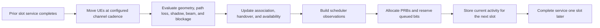

# Mobility, Handover, Dynamic Radio, and FR2 Availability

## Purpose and model boundary

The dynamic-radio model extends the verified static radio, capacity, and scheduler pipeline with
opt-in time-varying behavior.
It adds large-scale motion, causal load-coupled interference, handover, and a bounded FR2-1
availability model without changing the existing `tier-a-fr1-static-v1` path.

Two new fidelity profiles are available:

| Profile | Intended use |
| --- | --- |
| `tier-b-fr1-dynamic-v1` | FR1 mobility, correlated large-scale shadowing, handover, and load-coupled interference |
| `tier-b-fr2-availability-v1` | The same dynamic mechanics plus configured horizontal beams and explicit blockage intervals in FR2-1 |

These are transparent engineering abstractions, not a 3GPP protocol stack or calibrated network
digital twin. They do not model fast fading, RRC signaling, measurement filtering, HARQ, beam
training, radio-link failure, or re-establishment.

## Slot causality

Every dynamic slot executes through the existing deterministic event kernel:



The event phases guarantee that a position update at tick `k` is visible to association and
scheduling at `k`. Interference at `k` uses the activity committed at `k-1`; it never depends on
the order in which cells happen to schedule during the current slot. Slot zero uses the configured
initial load rather than an implicit full-buffer assumption.

## Activity-coupled interference

All cells use reuse one. Because this profile is frequency-flat, each allocation occupies the
lowest contiguous PRBs. If a UE receives `N_s` PRBs and a neighboring cell used `N_i` PRBs in the
previous slot, the overlap is

```text
N_overlap = min(N_s, N_i)
```

Signal, thermal noise, and every interferer are evaluated over the allocation bandwidth. Each
interferer is converted to watts before summation. Idle neighbors therefore contribute zero
data-PRB interference after the one-slot lag.

The result artifact keeps two related records:

- one `radio_frame` per slot with prior activity, every candidate link, full-allocation SINR,
  association, availability, position, and velocity;
- one `allocation_radio_diagnostic` per scheduled UE with the actual PRB count, exact overlap,
  per-interferer power, and SINR used to calculate served capacity.

This separation prevents a full-band scheduling estimate from being mistaken for the SINR of a
partial allocation.

## Mobility and correlated shadowing

`linear-reflect-v1` applies configured Cartesian velocity inside explicit rectangular bounds. A UE
reflects exactly at a boundary, preserves traveled distance, and keeps its height fixed. Positions
update only at the configured channel cadence.

Each link owns an independent semantic random stream for large-scale shadow evolution. At a
channel update,

```text
rho = exp(-delta_distance / correlation_distance)
X_k = rho X_(k-1) + sqrt(1-rho^2) sigma Z_k
```

where `sigma` comes from the selected TR 38.901 scenario/state row. Correlation is along one UE
trajectory only; cross-link and map-consistent spatial correlation are intentionally not claimed.
The initially selected explicit or probability-based LOS/NLOS state remains fixed for the run.
Dynamic UMa currently requires UE height at or below 13 m, where the supported effective
environment-height branch is deterministically 1 m; higher UMa UEs fail configuration rather than
silently resampling an untracked environment-height process during motion.

## Handover and availability

The handover state machine uses unfiltered long-term RSRP. For the strongest lexical-tie-broken
neighbor, it enters when

```text
M_neighbor - M_serving > offset + hysteresis
```

and cancels when the delta falls below `offset - hysteresis`. The candidate must remain entered
continuously for the configured time-to-trigger. A completed handover changes the serving cell at
the decision tick and excludes the UE from scheduling for the configured interruption. Returning
to the immediately previous serving cell inside the ping-pong window is counted explicitly.

Availability is a separate project-defined state. It enters outage after serving SINR remains at
or below the entry threshold for its dwell time, and recovers after SINR remains at or above the
higher recovery threshold for its dwell time. Traffic arrivals and deadlines continue during
outage or handover interruption, but the UE is not scheduler-eligible. This is not NR RLF.

## FR2-1 sensitivity profile

The FR2 profile accepts 24.25–52.6 GHz and the exact 60/120 kHz bandwidth/PRB pairs in TS 38.104
V18.12.0 Table 5.3.2-2. It uses only UMa or UMi-street-canyon large-scale TR 38.901 equations.

Each cell declares a horizontal beam codebook. For angular offset `delta`, beam gain is

```text
max(sidelobe_gain, peak_gain - 12 (delta / beamwidth)^2)
```

The maximum-gain beam is selected, with lexical beam ID ties. Configured link blockage windows use
half-open `[start,end)` boundaries and add the largest overlapping excess loss. This is useful for
controlled availability sensitivity analysis, but it is not an antenna-array, beam-management, or
stochastic blockage calibration.

## KPI contract

`dynamic-radio-1.0` reports per-UE and system handover/association-change counts, ping-pong count
and ratio, interruption fraction, availability-outage fraction, scheduling-availability ratio,
and mean serving SINR. Only samples or transitions in the configured measurement window count.
Zero handovers produce an undefined ping-pong ratio with `zero_denominator`, not a false zero.

Core bearer, UE, application, system, and scheduler-resource KPIs remain available. For a
dynamic run, packet/fairness metrics are not labeled per cell using the UE's final association;
only per-cell metrics directly reconstructable from cell scheduling intervals are retained.
Time-varying packet-to-cell attribution is intentionally deferred until its population convention
is frozen in the experiment contract.

## Run the examples

```console
uv run nr-ran-sim simulate \
  examples/scenarios/dynamic-fr1-mobility.yaml \
  --master-seed 0x11111111111111111111111111111111 \
  --replication-id 0 \
  --code-revision 1111111111111111111111111111111111111111 \
  --working-tree-state clean \
  --output artifacts/dynamic-fr1-mobility.json \
  --quiet
```

Replace the scenario with `fr2-mobility-availability.yaml` for the beam/blockage example.

## Visualization contract

The saved JSON is deliberately visualization-ready. A presentation layer can animate UE positions,
serving-cell color, handover markers, beam selection, blockage, outage, PRB activity, queue service,
and SINR without rerunning the simulator or reaching into live internal state. Multi-run experiment
tables and uncertainty consume those saved,
versioned artifacts rather than transient objects.
