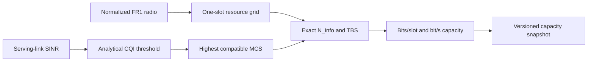

# NR Resource Grid and Link-Adaptation Model

## Purpose and claim boundary

The NR capacity layer converts static serving-link SINR into a reproducible NR transport
capacity for an explicit PRB allocation. It answers “how many coded payload bits fit in this
allocation under the selected analytical profile?” It does not answer how PRBs are shared, how
many application bits are served, or what throughput a real receiver achieves.

The implementation is 3GPP-informed and reference-verified within its stated one-layer domain;
the SINR threshold profile is project-derived and uncalibrated.

## Standards inputs

The pinned Release 18 inputs are:

- [TS 38.104 V18.12.0 Table 5.3.2-1](https://www.etsi.org/deliver/etsi_ts/138100_138199/138104/18.12.00_60/ts_138104v181200p.pdf): every supported FR1 bandwidth/SCS PRB count;
- [TS 38.211 V18.9.0 Tables 4.2-1 and 4.3.2-1, Clause 4.4.4.1](https://www.etsi.org/deliver/etsi_ts/138200_138299/138211/18.09.00_60/ts_138211v180900p.pdf): numerology, 14-symbol normal-CP slots, slots per subframe, and 12 subcarriers per PRB;
- [TS 38.214 V18.9.0 Tables 5.1.3.1-1, 5.1.3.2-1, 5.2.2.1-2 and Clause 5.1.3.2](https://www.etsi.org/deliver/etsi_ts/138200_138299/138214/18.09.00_60/ts_138214v180900p.pdf): MCS Table 1, small TBS values, CQI Table 1, its target error probability, and TBS determination.

The source PDFs are not redistributed.

## Processing chain



### Resource accounting

For normal CP, gross resources are `12 × 14 = 168 RE/PRB/slot`. The configured overhead is made
integer and inspectable:

`N_RE_uncapped = floor(168 × (1 - data_re_overhead_fraction))`

`N_RE_TBS = min(156, N_RE_uncapped)`

The output retains gross RE, configured fraction, uncapped result, capped result, whether the
cap applied, PRB count, numerology, and scheduling interval. This proportional abstraction does
not claim an exact DM-RS/PDCCH mapping.

### CQI and MCS

For CQI spectral efficiency `eta_i` and required margin `M_dB`, the project profile uses:

`threshold_i,dB = 10 log10(2^eta_i - 1) + M_dB`

The highest threshold at or below the observed SINR selects CQI. The highest MCS Table 1
efficiency not exceeding that CQI efficiency is then selected. Below CQI 1 is explicit outage.
CQI 1 has no compatible MCS Table 1 entry and therefore produces an explicit zero-capacity state,
not a silent MCS fallback.

The reported 0.1 transport-block error probability is CQI-table metadata. The code performs no
BLER sampling or HARQ and labels the profile `project-derived-analytical-uncalibrated`.

### Transport-block size and rate

The implementation applies Clause 5.1.3.2 with exact rational/integer decisions:

`N_info = N_RE × R × Q_m × layers × scaling`

It retains the numerator/denominator of `N_info`, quantized `N_info`, selected small/large branch,
code-block count, and final TBS. Capacity is `TBS / slot_duration`; integer bit/s output uses the
same integer-nanosecond time base as the simulator.

## Capacity snapshot

```console
uv run nr-ran-sim capacity-snapshot \
  examples/scenarios/uma-multicell-radio.yaml \
  --master-seed 0x11111111111111111111111111111111 \
  --replication-id 0 \
  --output artifacts/capacity-snapshot.json \
  --quiet
```

The artifact is canonical JSON with its own SHA-256 plus the exact radio-snapshot and
configuration identities. Each UE is evaluated independently with all 273 PRBs in the example.
Those rates are useful for a map, CQI/MCS explorer, histogram, and later scheduler comparison,
but they are neither simultaneous nor summable. A trustworthy animation waits for actual
time-varying channel/scheduler frames in downstream layers.

## Verification evidence

- Exhaustive FR1 PRB-table coverage includes every supported 15/30/60 kHz pair and rejects N/A.
- CQI, MCS, and all 93 small-TBS rows are checked against independently transcribed fixtures.
- Threshold equality, outage, CQI-without-MCS, monotonicity, zero-resource, and invalid allocation
  boundaries are tested.
- Nine retained exact-rational TBS vectors cover minimum, small-table gaps, the 3824-bit split,
  low-rate segmentation, large segmentation, and a full 273-PRB grid.
- The capacity artifact replays byte-for-byte in fresh processes and remains portable through
  the same 12-significant-digit JSON interchange rule as the radio snapshot.

Detailed evidence is indexed in
[the NR capacity requirements index](../verification/nr-capacity-requirements-index.yaml) and consolidated
in the [validation report](../verification/verification-and-validation-report.md).

## Boundary with scheduling and service

- scheduler allocation and multi-user resource conservation;
- queue service, packet completion, throughput/goodput, delay, fairness, and utilization;
- CQI reporting delay/filtering for a time-varying channel;
- calibrated BLER/link curves, HARQ, fast fading, and activity-coupled interference;
- temporal radio-state animation.
